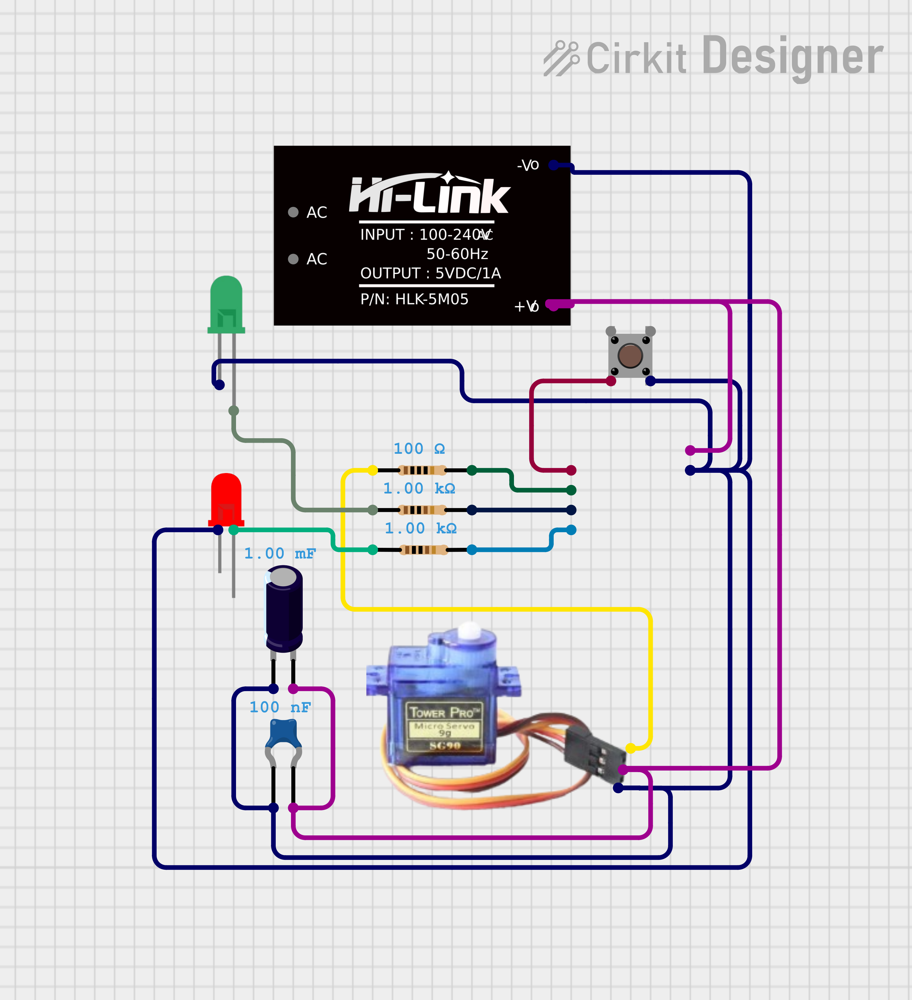

# Vent Servo Controller (XIAO ESP32C3 + SG90)

ESP32‑C3 (Seeed XIAO) drives an SG90 damper servo. One pushbutton toggles OPEN/CLOSED. Two LEDs show state. Powered from HLK‑5M05 (5 V, 1A).

## Circuit



## Hardware
- Seeed **XIAO ESP32C3** (4 MB flash)
- **SG90** servo (PWM on GPIO4/D2, 5 V) + decoupling **1000 µF + 0.1 µF** near the servo
- **Pushbutton** (tactile, 4‑pin; GPIO3/D1 → GND, `INPUT_PULLUP`)
- **LED OPEN** (green, GPIO5/D3) + **LED CLOSED** (red, GPIO6/D4), each with **1 kΩ** series resistor
- **HLK‑5M05** 5 V/1 A AC‑DC module

## Pin Map

| GPIO | Function | Notes |
|------|----------|-------|
| 3 (D1) | Pushbutton | Active‑low, internal pull‑up |
| 4 (D2) | SG90 PWM | Via 100 Ω resistor |
| 5 (D3) | Green LED (OPEN) | Via 1 kΩ resistor |
| 6 (D4) | Red LED (CLOSED) | Via 1 kΩ resistor |

## Firmware features
- **Web UI** on port 80 — LED status, servo angle control (slider + quick buttons), full hardware diagnostics
- **OTA** firmware upload via `/ota`
- **mDNS** — device reachable as `<hostname>.local`
- **Wi‑Fi provisioning** via SoftAP on first boot
- Physical pushbutton toggles OPEN (90°) / CLOSED (0°)

## Web API

| Method | Path | Description |
|--------|------|-------------|
| GET | `/` | Main page (LED status, motor control, diagnostics) |
| GET | `/status` | JSON: `{servo_angle, led_open, led_closed}` |
| POST | `/servo` | Set angle: body `{"angle":90}` |
| GET | `/hw_details` | Full hardware diagnostics JSON |
| GET | `/ota` | OTA upload page |
| POST | `/update` | Upload firmware binary |

## Build

```
# PlatformIO
pio run -t upload
pio device monitor
```

## Flash layout (4 MB, OTA)

| Partition | Offset | Size |
|-----------|--------|------|
| nvs | 0x9000 | 20 KB |
| otadata | 0xE000 | 8 KB |
| ota_0 | 0x10000 | 1984 KB |
| ota_1 | 0x200000 | 1984 KB |
